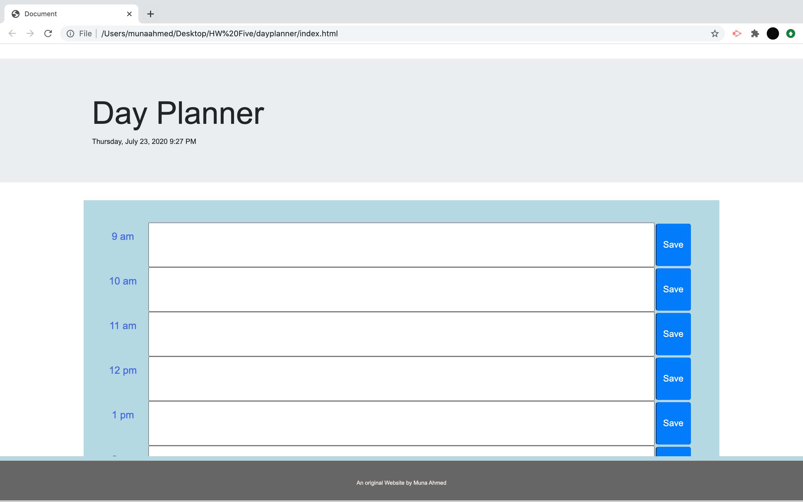
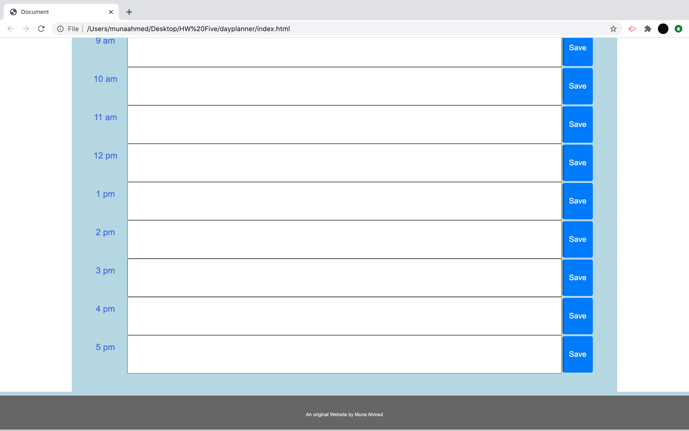

# dayplanner

**Overview:**

This project is a day planner. It can be used to keep track of your daily tasks for the day. It is seperated into boxes by the hour, ranging from 9am to 5pm. You can use a save button to save the information that you have imputed for the hour. At the top of the planner is the day of the week, hour of the day, as well as the date. 

**Link to Deployed Application**

https://munaaahmed.github.io/passgen/

**Deployed Application Images**

